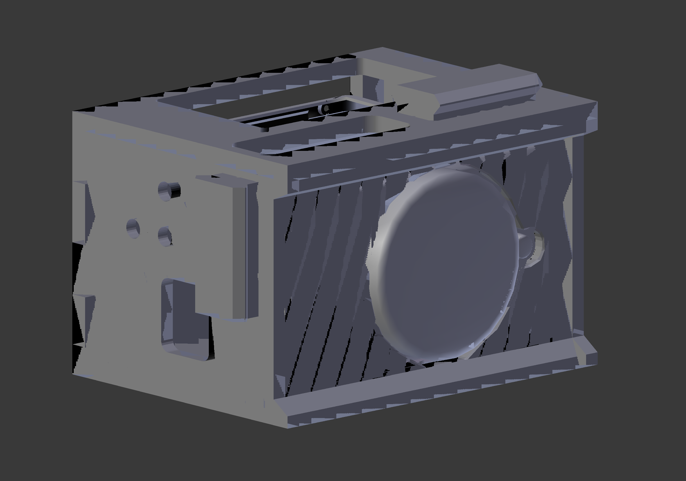

# m100-box-rehouse

A rehousing project to learn a bit about 3d printing and rehousing a camera in a way that is non-destructive to older cameras. 

## TODO

* Allow nato rail on both sides
* Create holes for cheese plates
* Add integrated coldshoe in top plate
* Wire routing would be a nice to have?
* Create nicer designs for the side and top plates 
